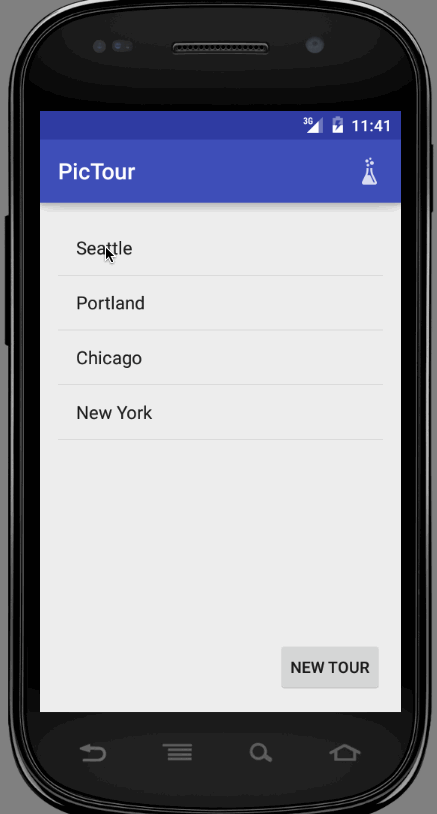

# PicTour

**PicTour** is a way to explore an area through the eyes of another person. An individual can craft a walking tour for any theme they wish, providing locations and a map, explaining why the locations are special and giving insight into local color. Have you ever noticed a particularly special set of decorative manhole covers in Ballard? Plan an optimal route to visit them all, take photos of each location, and then share the route through PicTour. Others can download the app and then follow your route step by step, walking in your footsteps and seeing the world through your eyes.

## User Stories

Users take on two roles within the app: Tour guides and Explorers

### Tour Guides

* Create a new walking Tour and give it a colorful name and description
* In order to create your Tour, you must first go on the Tour yourself, visiting each location
* Add a new Stop on the Tour, providing a photo that captures the experience, title, and description.
* The photo's location data will be used to place this location as a pin on the map
* After saving a stop, user can choose to move on to the next stop or return to the Tour summary page to see the Tour overview and the Stops already on the route
* When your tour is complete, you can submit the tour to PicTour for others to see and experience
* (optional) Tour Guide can drag to reorder the tour stops
* (optional) Allow a user to add a photo and location when you are not physically present by providing a photo from your saved photos and lat/long coordinates
* (optional) Estimate how long a person should spend at each place to get the full experience and point out some tips or highlights in the description
* (super optional) Allow the Guide to submit an audio file to talk the Explorers through the area
  * (super duper optional) Offer the ability for the audio to start playing automatically as the Explorer nears the location of a Stop

### Explorers

* Select a tour from the list and click begin to go on a new adventure
* The tour opens up in a map, giving a path to take between the stops in the order determined by the tour guide
* Walking directions to each Tour Stop are computed by [Google Maps' walking directions](https://developers.google.com/maps/documentation/directions/?hl=en)
* User can switch between map view and list view, where a photo and short description is given
* Clicking on the map pin or the list item will open a detailed view of the spot
* Explorer can click "begin tour" to have Google maps open and begin providing walking directions to the first location in the tour
* Upon reaching the stop in the tour, Google will begin providing walking directions 
* (optional) Explorers can create an account and log in
* (optional) Allow Explorers to submit their own photos, which will show up in a gallery for each location
* (optional) Explorers can "check in" to locations on the tour

### Things that Would Be Nice to Have but We Definitely Don't Have Time for
* Vote on tour quality and leave comments on picTours as well as on each Stop
* Explorers can see a history of picTours they have been on
* Sort nearby tours by distance
* Users can search for a tour by tags
* Browse tours by cities or regions
* If a tour location has a Groupon, promote it :)
* Tours will give an estimate of approximately how long they take to complete based on the Tour Guide supplied "suggested time to spend at place" and the walking directions given by google maps
* Difficulty ratings on tours
* Play a sound or send a push notification when a user has reached a Stop on the Tour

## Mockups and basic interactions

[Interactive mockup](https://www.fluidui.com:443/editor/live/preview/p_Llo6CBk71dl34aegf4O0yK1vT12i5rzy)

## Relational database schema

[Relational db schema](schema.md)

## Walkthrough

Walkthrough of the functionality of our app so far.

You'll need to use your imagination for the map portion, as well as the list views that will eventually be populated with live data from the backend. For this demo we used some hardcoded data. The images and tour location information *are* currently being stored to parse.com, we just aren't pulling them back down. Our next steps are to retrieve those images/entries and display them. Lastly the style of the app will get an overhaul.

